<p align="center">
  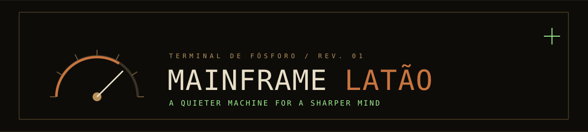
</p>

<p align="center">
  <a href="#the-desktop">Explore</a> · <a href="#the-system">Design system</a> · <a href="#get-started">Get started</a> · <a href="docs/PRESENTATION.md">Theme presentation</a> · <a href="docs/presentation.html">Slide deck</a> · <a href="docs/INSTALL.md">Installation guide</a>
</p>

<p align="center">
  
  
  
  
</p>

> **Mainframe Latão** turns a Hyprland workstation into a quiet instrument panel: near-black canvas, fine brass lines, copper controls, and phosphor-green signals. It was built from the supplied HTML and PNG references and tuned on a 32-inch, 1920 × 1080 display.

<p align="center">
  <a href="docs/images/dashboard.png">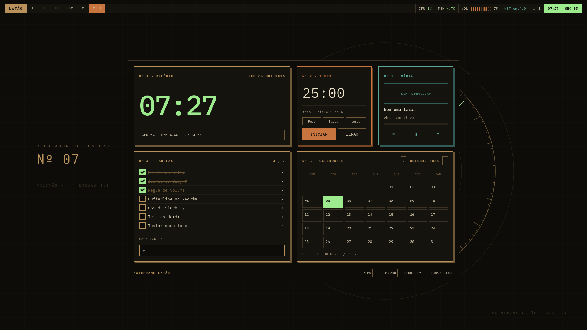</a>
  <br><sub>01 / The dashboard — real clock and metrics, persistent tasks and timer, media controls, calendar. Sample tasks appear only in this preview.</sub>
</p>

## The desktop

The theme carries one visual language across the whole session. Regular applications **tile with fine gaps**. The Yazi scratchpad floats at a compact 1160 × 740 logical pixels, leaving the wallpaper visible on the reference display.

<table>
<tr><th align="left">Surface</th><th align="left">What it does</th></tr>
<tr><td>Hyprland + Hyprpaper</td><td>Sharp borders, opaque windows, instrument wallpaper, two focus workflows.</td></tr>
<tr><td>Waybar + dashboard</td><td>Roman workspaces; live CPU, memory, network, volume and clock; a task, timer, media and calendar panel.</td></tr>
<tr><td>Rofi + clipboard</td><td>Application launcher and searchable history with copy, pin and delete actions.</td></tr>
<tr><td>SwayNC</td><td>Compact notifications, volume, mute and focus controls.</td></tr>
<tr><td>Kitty + Fish + Starship</td><td>IBM Plex typography, block cursor, coordinated terminal and prompt.</td></tr>
<tr><td>Neovim + Yazi</td><td>Editor colors, tabs and Lualine; phosphor selection, brass directories and code previews in the file manager.</td></tr>
<tr><td>Firefox + Sidebery</td><td>Brass browser chrome, vertical tabs and a local clock/search page.</td></tr>
<tr><td>Herdr + Bat + Btop + GTK 3</td><td>Matching application colors and controls.</td></tr>
</table>

### A tour in screenshots

<table>
<tr><td width="50%"><a href="docs/images/yazi.png">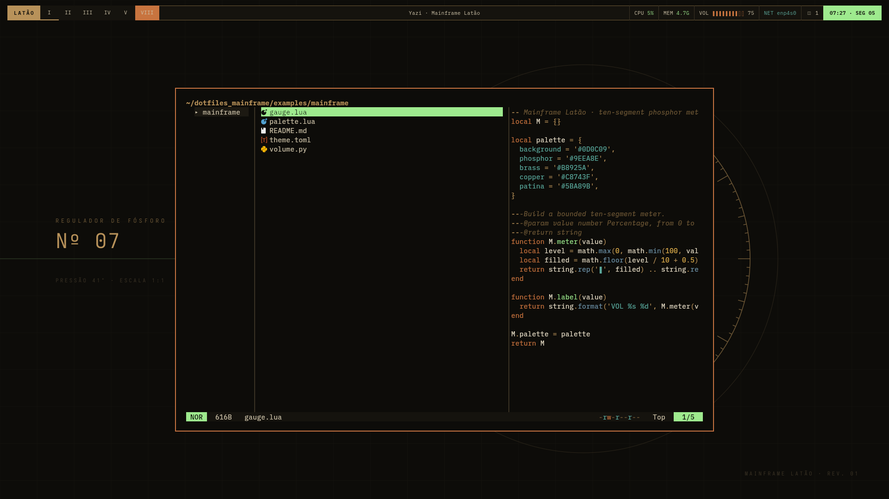</a><br><b>02 / Files.</b> Yazi uses the full palette, including selected rows, status and preview syntax.</td><td width="50%"><a href="docs/images/neovim.png">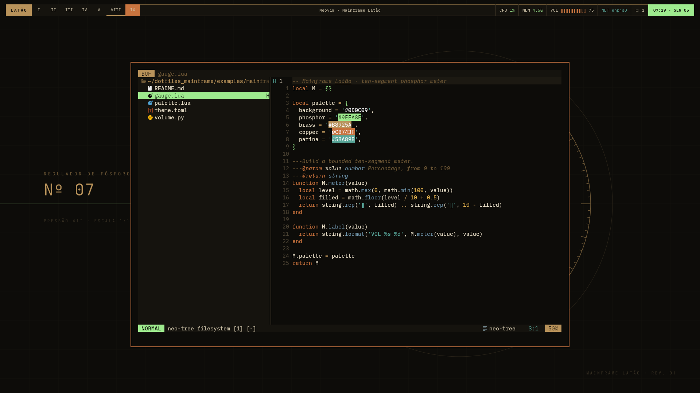</a><br><b>03 / Code.</b> A quiet editor surface with rectangular buffer tabs.</td></tr>
<tr><td><a href="docs/images/firefox.png">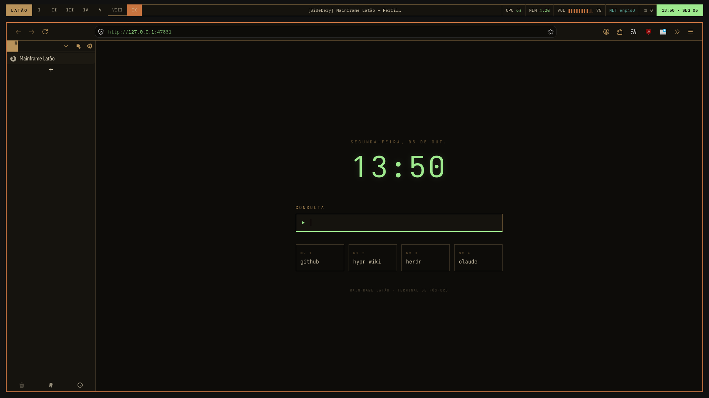</a><br><b>04 / Browse.</b> A local clock and search page framed by the browser theme.</td><td><a href="docs/images/launcher.png">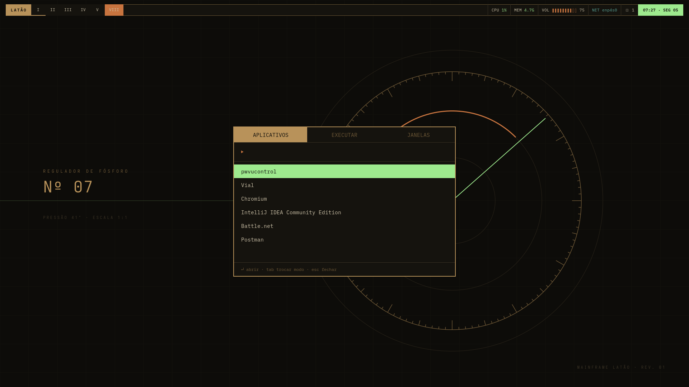</a><br><b>05 / Launch.</b> Compact keyboard-first application access.</td></tr>
<tr><td><a href="docs/images/volume.png">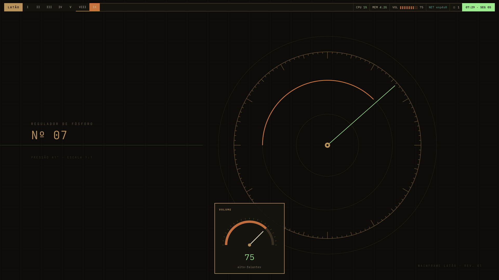</a><br><b>06 / Volume.</b> Instrument-style gauge OSD for volume changes.</td><td><a href="docs/images/notifications.png">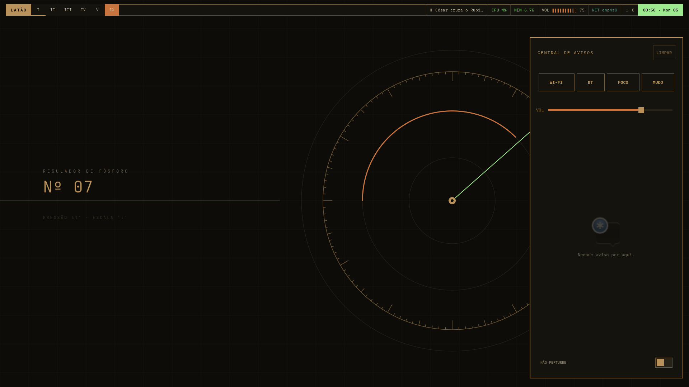</a><br><b>07 / Notify.</b> Notification center with volume, brightness, Wi-Fi, Bluetooth and focus toggles.</td></tr>
<tr><td><a href="docs/images/focus.png">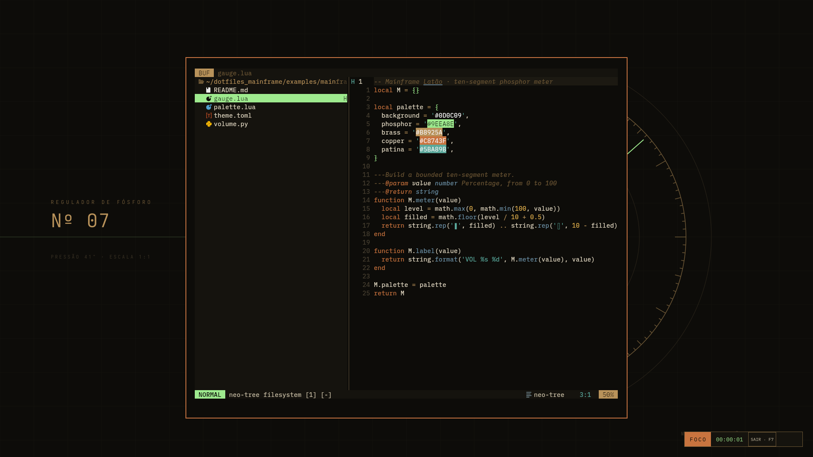</a><br><b>08 / Focus.</b> Wider gaps, hidden bar and an elapsed-time HUD at the bottom corner.</td><td><a href="docs/images/widgets.png">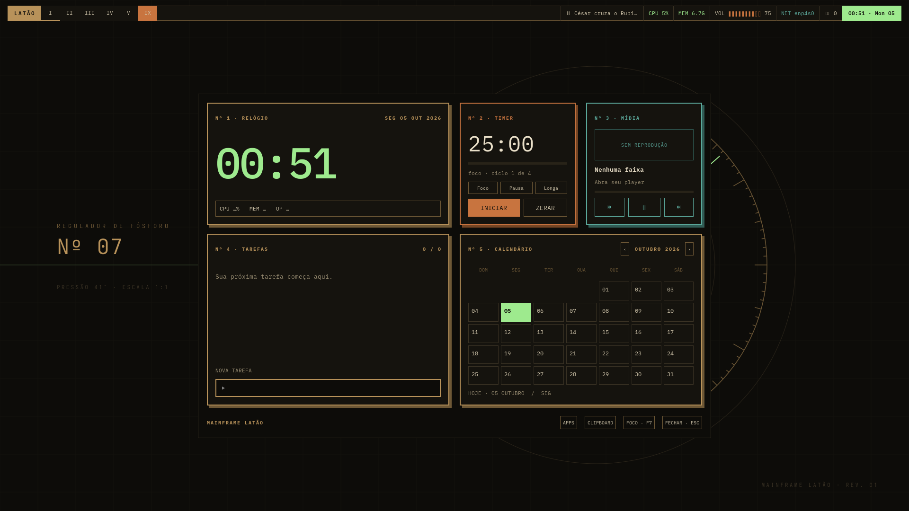</a><br><b>09 / Widgets.</b> Clock, Pomodoro timer, media controls, tasks and calendar in one panel.</td></tr>
<tr><td><a href="docs/images/herdr.png">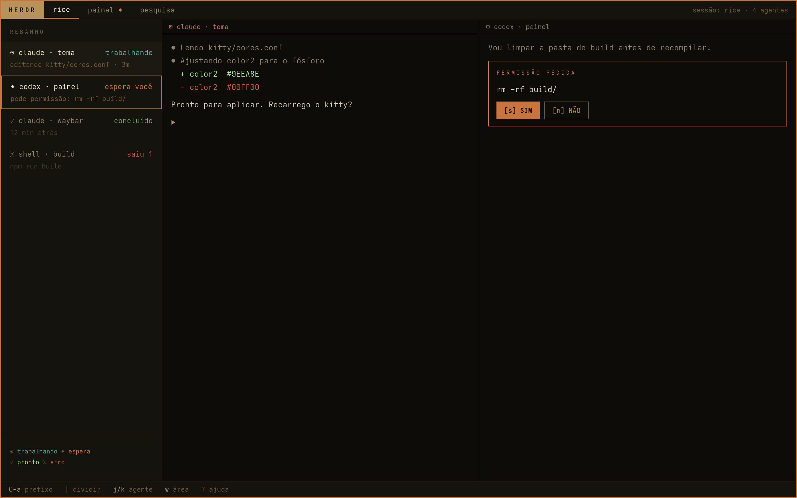</a><br><b>10 / Herdr.</b> Multi-agent terminal manager with status sidebar and split panes.</td><td><a href="docs/images/gtk.png">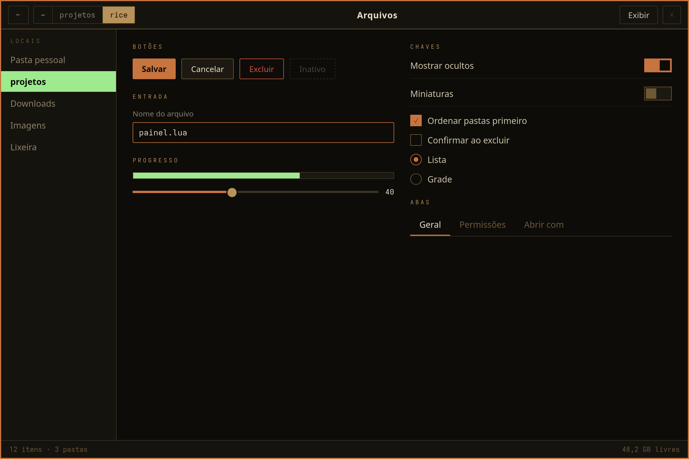</a><br><b>11 / GTK.</b> File manager with themed buttons, switches, progress bars and tabs.</td></tr>
<tr><td colspan="2" align="center"><a href="docs/images/btop.png">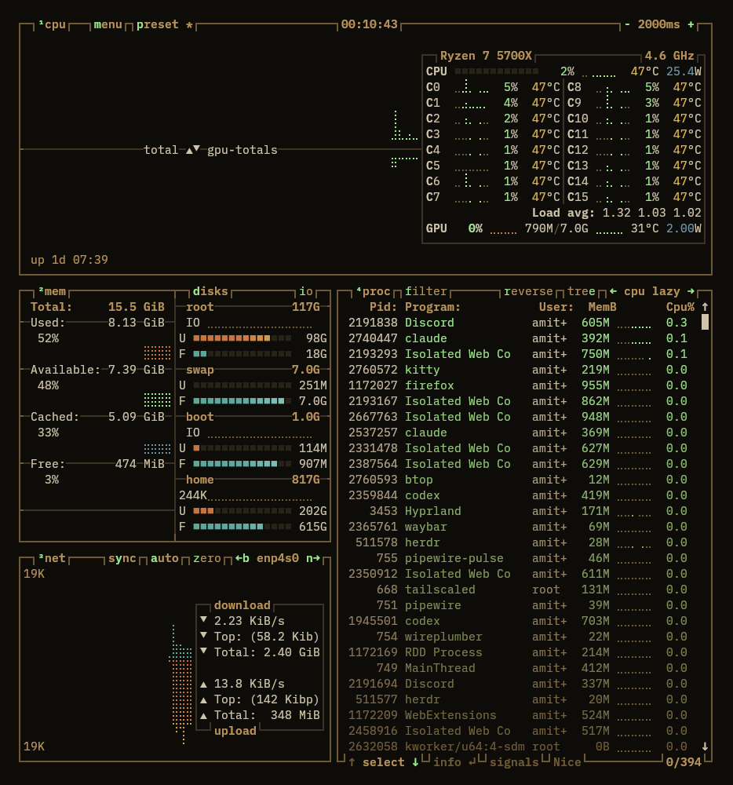</a><br><b>12 / Monitor.</b> Btop with CPU, memory, disk, network and process list in coordinated palette.</td></tr>
</table>

[Read the screenshot narrative →](docs/PRESENTATION.md) · [Get the interactive slide deck →](docs/presentation.html)

To view the interactive deck, clone or download this repository and open `docs/presentation.html` in a browser. Use the arrow keys to advance and **F** for fullscreen.

## The system

| Pigment | Hex | Role |
| :--- | :--- | :--- |
| Canvas | `#0D0C09` | Almost-black desktop and terminal |
| Panel | `#15130E` | Cards and controls |
| Brass | `#B8925A` | Rules, labels and structure |
| Copper | `#C8743F` | Active border and primary actions |
| Phosphor | `#9EEA8E` | Selection, clock and live values |
| Parchment | `#E9DFC8` | Primary text |
| Patina | `#5BA89B` | Media and secondary information |

IBM Plex Mono and IBM Plex Sans Condensed give the interface its measured rhythm. Square corners, two-pixel borders and opaque surfaces keep the reference artwork crisp. Physical monitor size does not set UI scale: the layout was tuned at **1920 × 1080, scale 1** and may need size adjustments at other logical resolutions.

## Get started

This is an **overlay for an existing Arch/Hyprland Lua desktop**. It preserves the machine's monitor and input setup while backing up every managed file. Review [requirements and integration details](docs/INSTALL.md) before applying it.

```sh
git clone https://github.com/Rodericuss/dotfiles-mainframe.git
cd dotfiles-mainframe
./apply.sh --dry-run
./apply.sh
./activate.sh
```

Reapplying retains the backup from the first installation. To inspect or perform a rollback:

```sh
./restore.sh --dry-run
./restore.sh
```

| Key | Action |
| :--- | :--- |
| `Super + Tab` or `Super + T` | Dashboard |
| `Super + Space` | Application launcher |
| `Super + O` | Clipboard history |
| `Super + N` | Notification center |
| `F8` | Window focus: wider gaps, bar hidden, DND and elapsed HUD; Yazi moves into the top-left gap |
| `F7` | Swap the local normal/focus Hyprland config pair, when installed; otherwise use F8 behavior |
| Volume media keys | Change volume and show the instrument OSD |
| `:MainframeFocus` or `<leader>uz` | Neovim focus mode |

## Built and checked on a real desktop

The screenshots are `grim` captures from a running Wayland session. The dashboard screenshot uses isolated sample tasks; personal browser tabs and conversations are excluded. The application versions checked were Hyprland 0.56.2, Kitty 0.48.2, Waybar 0.15.0, Rofi 2.0.0, SwayNC 0.12.6 and Yazi 26.9.1.

```sh
python -m unittest discover -s tests -v
```

The tests cover install, reapply and restore; task persistence; timer completion; and calendar boundaries. The live checks covered compositor loading, the clipboard store/decode path, Yazi rendering, volume OSD and browser routing. See [installation and limitations](docs/INSTALL.md) for details.

<sub>Designed from the supplied Mainframe Latão references. [IBM Plex](https://github.com/IBM/plex) fonts retain their [SIL Open Font License](fonts/OFL.txt). Built with [Hyprland](https://hypr.land), [Yazi](https://yazi-rs.github.io), GTK and the other tools listed above. The optional Firefox new-tab adapter is [New Tab Override](https://addons.mozilla.org/firefox/addon/new-tab-override/). Reference artwork and upstream applications retain their respective rights.</sub>
